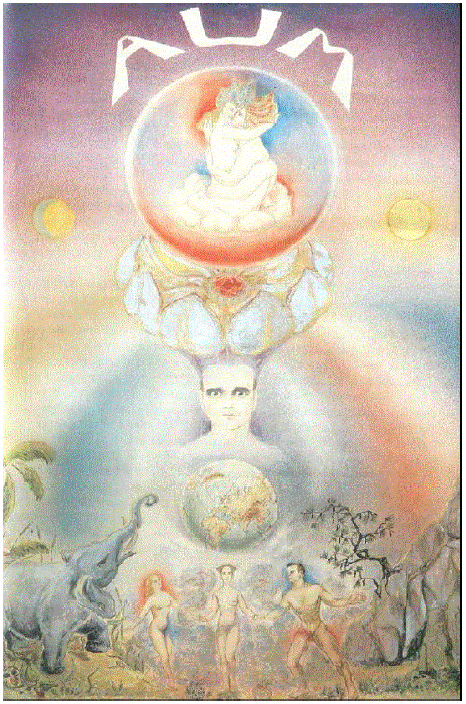
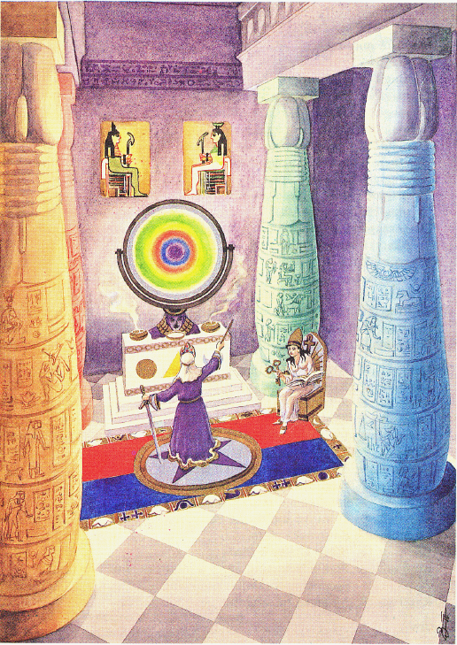
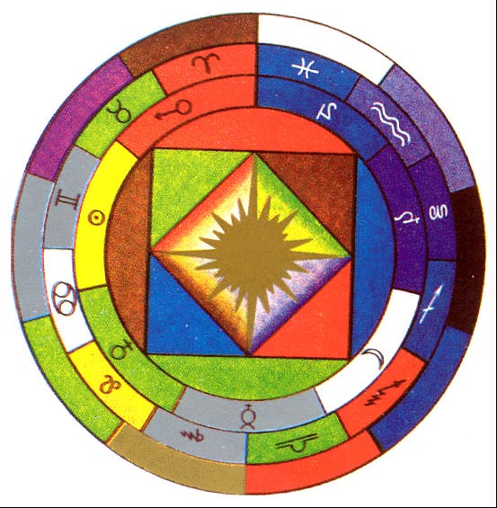
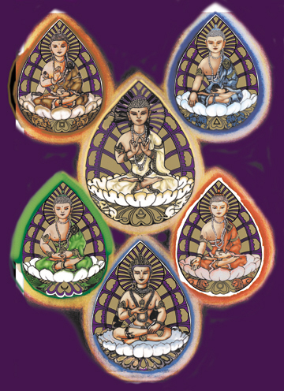

- Je jedna strana [zlatej knihy múdrostí](Zlatá kniha múdrostí)
- Inak aj ako arkán
- Je zasväcovacou knihou obsahujúcou v symboloch najvyššie ukryté tajomstvá
- Najväčšie české fórum, ktoré pojednáva o dielach a učení Frabata je [Frabato forum](https://frabato.cz)
- Najväčšia zbierka diel Frabata [Czech Hermetics](https://czechhermetics.com)
- Tarotové karty:
	- Prvá ([[Brána k opravdickému zasväteniu]]):
	  Obraz mága, znázorňujúceho zvládnutie živlov a držiaceho kľúč k prvému arkánu (tajomstvu nevysloviteľného mena Tetragramatonu ->
	  -> kabalistickému JOD-HE-VAU-HE)
	  {:height 712, :width 466}
	  Vysvetlenie:
		- Dole je symbolicky vyjadrená ríša živej a neživej prírody.
		- Žena naľavo, muž napravo znamenajú protipóly (PLUS a MÍNUS) u ľudí.
		- Medzi ženou a mužom je hermafroditná bytosť (muž a žena v jednej osobe) na znamenie vyrovnanosti medzi mužským a ženským princípom.
		- Je tam elektrické fluidum naznačené červenou farbou a magnetické fluidum naznačené modrou farbou.
		- U ženy oblasť hlavy elektrická a oblasť pohlavia magnetická, u muža oblasť hlavy magnetická a oblasť pohlavia elektrická.
		- Nad hermafroditom je glóbus, symbolizujúci sféru zeme, nad ktorou je znázornený mág so štyrmi živlami.
		- Nad mužom sú aktívne živly (červenou živel ohňa a modrou živel vzduchu).
		- Nad ženou sú pasívne živly (zelenou živel vody a žltou živel zeme).
		- Stred obrazu pozdĺž mága až k glóbusu je temne fialový na znázornenie akášického princípu.
		- Nad hlavou mága je zakreslený neviditeľnou páskou strieborný, zlatom vrúbaný lotos ako koruna na znázornenie božstva.
		- Stred koruny vypĺňa rubínovo-červený kameň mudrcov ako symbol alebo kvintesencia celej hermetickej vedy.
		- Vpravo na pozadí je slnko vo zlatožltej farbe a vľavo na pozadí je mesiac vo striebornej farbe ako PLUS a MÍNUS v mikrokozme a makrokozme a ako elektrické a magnetické fluidum.
		- Nad lotosom je guľovito symbolicky znázornený vesmír a stred gule vypĺňa symbol tvorivej sily plus a mínus, tvorivý akt univerza.
		- Písmenami AUM a temno-fialovou až skoro čiernou farbou je vyjadrené ono NEKONEČNÉ, VEČNÉ, NEOHRANIČENÉ a NOSTVORENÉ.
		- Meč -> živel [ohňa](Oheň)
		- Palica -> živel [vzduchu](Vzduch)
		- Pohár -> živel [vody](Voda)
		- Mince -> živel [zeme](Zem)
	- Druhá ([[Prax magickej evokácie]]):
	  Zasväcovací chrám
	  {:height 737, :width 516}
	  Vysvetlenie:
		- Znázornený je (Šalamunov) chrám zasvätenia, ktorý je identický s mikrokozmom (malým svetom).
		- Chrám podopierajú štyri stĺpy, ktoré znázorňujú štyri živly, ktoré znamenajú vedenie, odvahu, chcenie a mlčanie, teda kabalistické Jod He Vau He, čiže Tetragramaton.
		- Každý stĺp stojí na guľatom podstavci (otesanom kameni) ako symbol toho, že mág, ktorý prijíma v chráme zasvätenie, sa stal už dokonalým pánom každého živlu.
		- Čiernobiela mramorová podlaha má rovnomerné štvorce, ktoré predstavujú pozitívne a negatívne pôsobenie živlov na hrubo-hmotnom svete. Vo vyššom zmysle je to zákonitosť sféra Jupitera na hrubo-hmotnej úrovni [TODO]
	- Tretia ([[Kľúč k opravdickej kabale]]):
	  Vzťah Mikrokozmu a Makrokozmu
	  
	  Vysvetlenie:
		- Prvý vonkajší kruh je rozdelený do desiatich rovnomerných oddielov, ktoré znázorňujú desať kabalistických kľúčov. Týchto desať kabalistických kľúčov, viď ich farebnú symboliku je identických s desiatimi hebrejskými sefirotmi. Keďže obsahujú tieto kľúče, sefiroty, vedu celého univerza so všetkými tvarmi súcna, metódami a sústavami, zaujímajú tiež prvý vonkajší kruh. Že majú tieto kľúče vzťah ako k mikrokozmu, tak aj k makrokozmu, vysvitá aj z toho, že sa v ďalšom, teda v druhom kruhu zračí zverokruh celého univerza – taktiež v príslušnej symbolike farieb. (Baran, Býk, Blíženci, Rak, Lev, Panna, Váhy, Škorpión, Strelec, Kozorožec, Vodnár, Ryby)
		- Tretí kruh, zvonku dovnútra, je planetárny, ktorý sa vyznačuje planetárnymi symbolmi a farbami, ktoré sú v analógii s planétami. (Merkúr, Venuša, Mars, Jupiter, Saturn, Urán, Neptún)
		- Všetky tri kruhy obopínajú veľký štvorhran, ktorý je symbolom štyroch živlov a má taktiež príslušnú symboliku farieb. Tento štvorhran poukazuje na realizáciu živlov a platí za symbol hrubohmotného sveta.
		- Vnútorný menší štvorhran znázorňuje tatragramatonické tajomstvo, ono Jod He Vau He, čiže kabalistický štvorokľúč, ktorého je napríklad na ovládanie živlov a ich vplyvov.
		- Slnko, nachádzajúce sa v strede obrazu, znázorňuje Božskú Prozreteľnosť, akášický princíp, pôvod všetkého súcna.
		- V tomto obrazci je teda graficky znázornený ako človek, mikrokozmos, tak aj celý makrokozmos. Ďalej sú v ňom zakreslené všetky kľúče, z ktorých markantne vystupuje najmä štvorokľúč, pretože je kľúčom k realizácii, k uskutočneniu. Všetko, čo kabala učí, jej celá sústava, všetky prívlastky, sú z obrazca a v symbolike farieb zreteľne viditeľné. Meditujúci mág nájde teda v symbolike tretej tarotovej karty všetky prívlastky, takže mu týchto niekoľko vysvetľujúcich oporných bodov úplne postačí.
	- Štvrtá [[Zlatá kniha múdrostí]] :
	  Obraz Budhov
	  