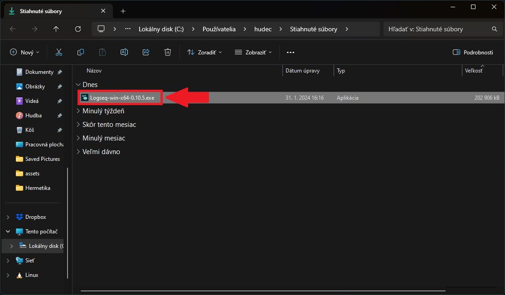
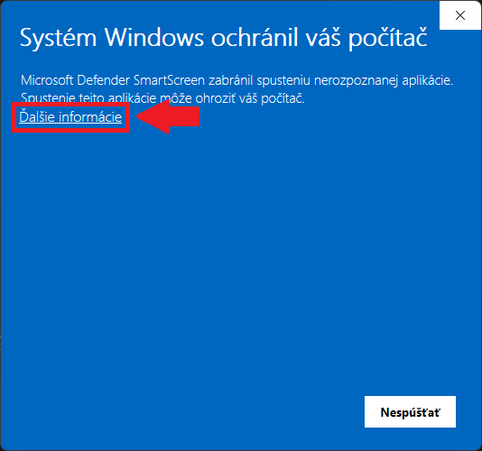
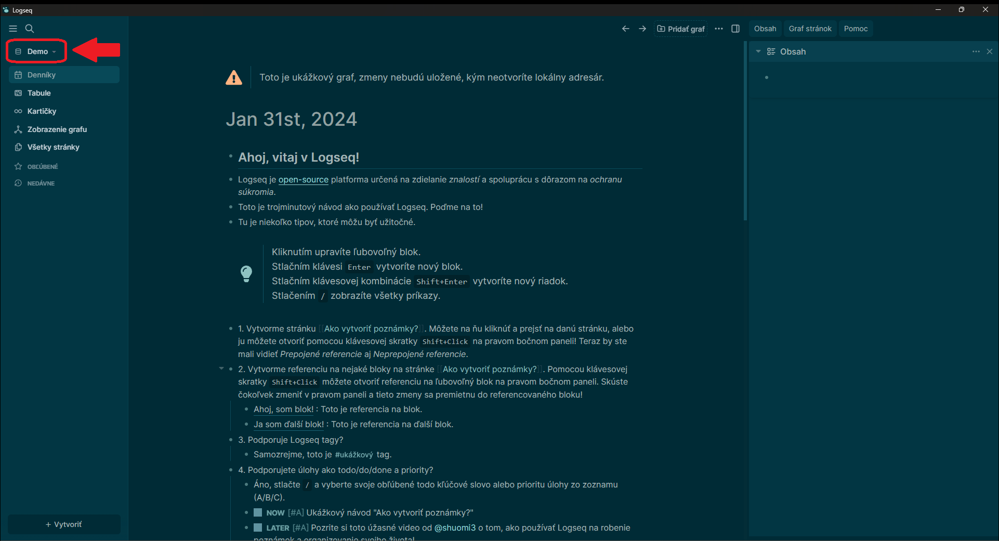
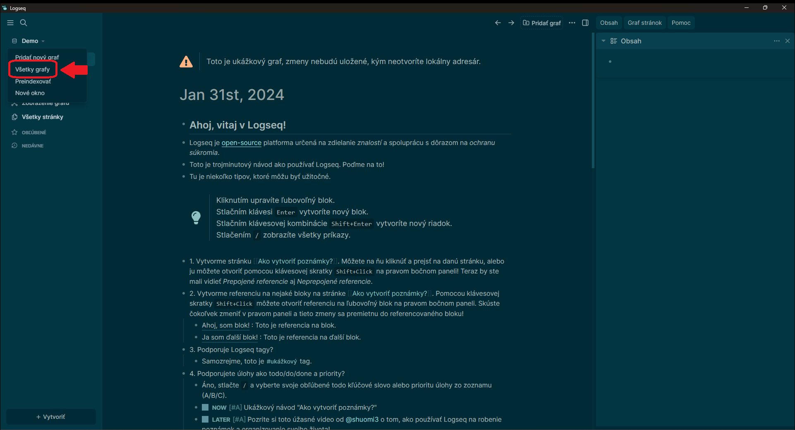
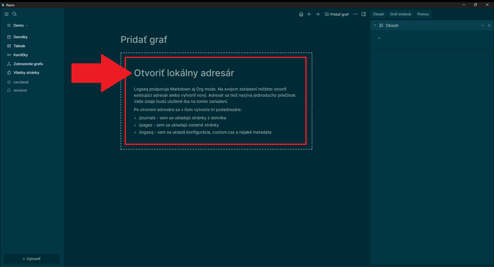
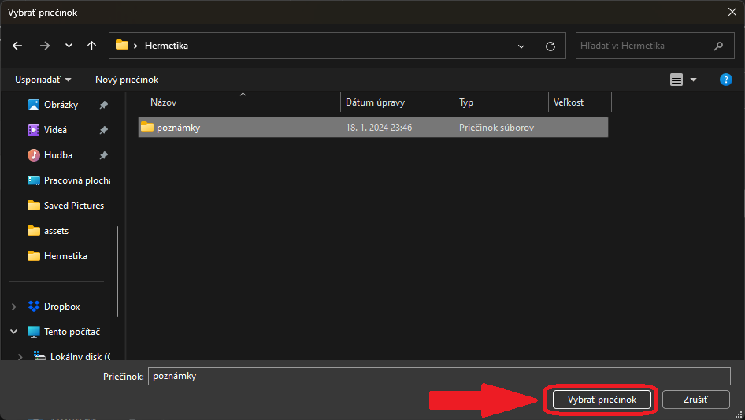
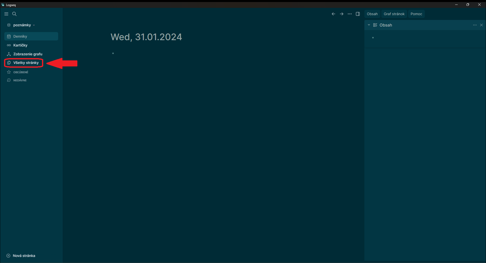
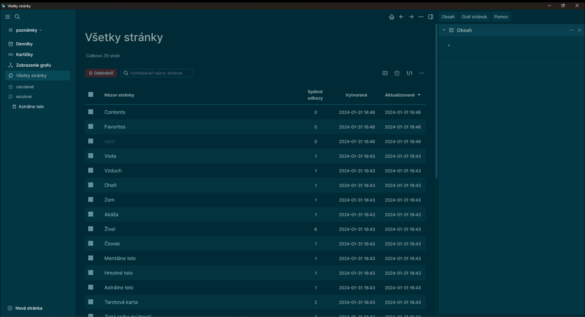

# Hermetika
## Moja hermetická náuka od Frantíška Bardona
- Poznámky sú vytvorené v programe LOGSEQ -> bezplatná aplikácia s otvoreným zdrojom na vytváranie poznámok, správu úloh, vytváranie diagramu znalostí a ďalšie
- Pomocou LOGSEQ som aj vygeneroval GitHub Page: https://matej-hudec.github.io/Hermetika/
### Ako nainštalovať program LOGSEQ a otvoriť v ňom poznámky
1. Stiahni si inštalačku programu LOGSEQ zo stránky https://logseq.com  

2. Otvor a nainštaluj program LOGSEQ, automaticky sa ti otvorí demo poznámok vytvorených v tom programe  

3. Stiahni poznámky https://github.com/Matej-Hudec/Hermetika/archive/refs/heads/main.zip a vyextrahuj si priečinok poznámky
   - pomocou WinRar, 7zip, WinZip alebo windowsa prieskumníka
4. Vlož poznámky do programu LOGSEQ  

